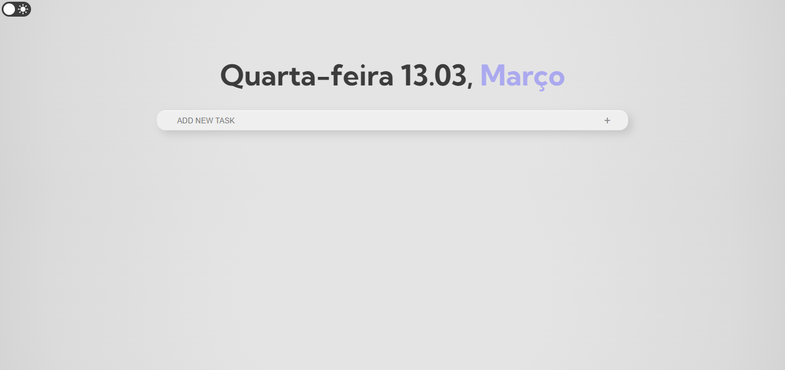
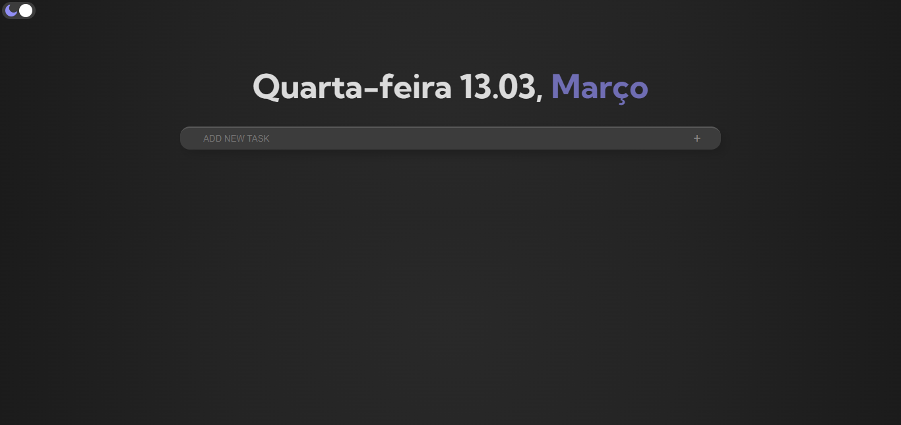
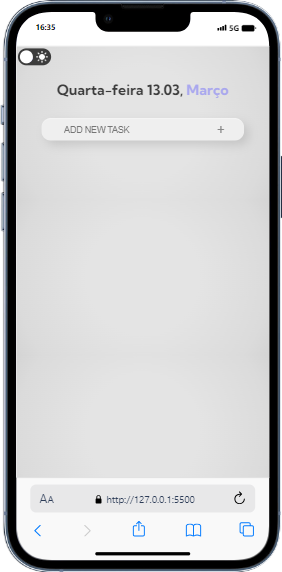
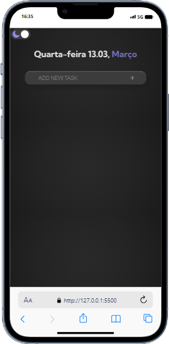

# Lista de Tarefas

  Meu mais recente projeto de estudo concentrou-se na criação de um Todo List, onde você pode criar, remover e marcar suas tarefas como concluídas, proporcionando uma experiência de produtividade sem complicações. Além disso, adicionei uma opção para alternar entre temas claro e escuro, para se adaptar ao seu ambiente de trabalho. 

No entanto, vale ressaltar que, por enquanto, o aplicativo não possui uma funcionalidade de armazenamento.

> <a href="https://karolinyrufino.github.io/to-do-list/">Deploy</a>

<h3>Versão Desktop</h3>

  

<h3>Versão Desktop Dark Theme</h3>

  

<h3>Versão Mobile</h3>

  

<h3>Versão Mobile Dark Theme</h3>

  
